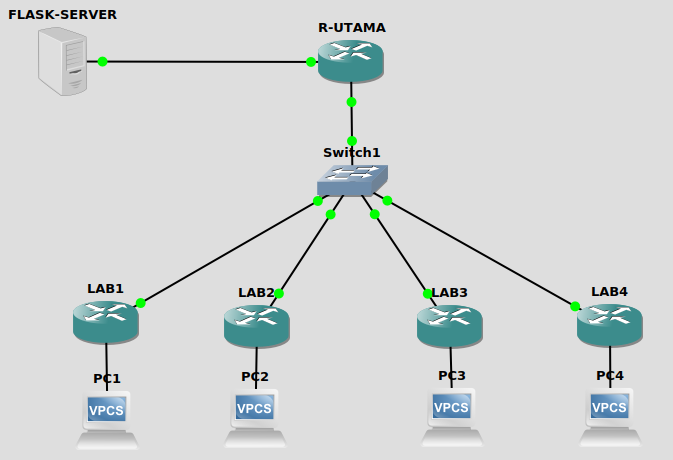

# Network-Automation-Mikrotik-PFFP (Python-Fetch-Flask-Paramiko)
Network Automation in Mikrotik with Python-Fetch-Flask-Paramiko
<h3>Topology</h3>
Repository menggunakan topology berikut:

<h3>Materi</h3>
mendapatkan ip address dari mikrotik dan dikirim menggunakan tool fetch ke flask python:
<ol>
<li>membuat dhcp leases mikrotik yang dituliskan pada /ip dhcp-server lease-script dengan materi:</li>
    <ul>
    <li>foreach script mikrotik</li>
    <li>tool fetch mikrotik</li>
    </ul>
<li>membuat app.py dengan materi:</li>
    <ul>
    <li>flask</li>
    <li>request</li>
    <li>json</li>
    <li>render_template</li>
    <li>file append</li>
    <li>file read</li>
    </ul>
<li>membuat file ip_address.txt untuk menyimpan ip address yang diambil dari fetch mikrotik</li>
<li>membuat file index.html untuk menampilkan isi file ip_address.txt ke web browser</li>
</ol>